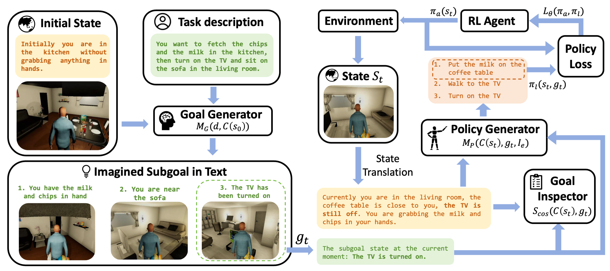

# LLMRL
This is a demo implementation for ICRA 2025 paper Goal-Guided Reinforcement Learning: Leverging Large Language Models for Long-Horizon Task Decomposition. LLMRL utilizes LLMs to decompose complex long-horizon tasks into subgoals and generate policies to provide guidence for goal-based exploration and training speedup.

\* The task environment is based on [TWOSOME](https://github.com/WeihaoTan/TWOSOME) and [ROMAN](https://github.com/etriantafyllidis/ROMAN), the vanilla PPO implementation is based on [PPO-Pytorch](https://github.com/nikhilbarhate99/PPO-PyTorch) for which we modified to fit the proposed framework. 

<p align="center">
<br>
</p>

## Environment Installation
The code has been tested on Ubuntu 20.04, it should also work for other distributions. Simply the environment and dependencies can be installed by running the following commands:
```shell
git clone https://github.com/ChirikjianLab/LLMRL.git
cd LLMRL/
conda create -n LLMRL python=3.9
conda activate LLMRL
pip install -r requirements.txt
```

## QuickStart
### For running LLM-guided RL
```shell
export OPENAI_API_KEY=#YOUR_OPENAI_API#
python LLMRL/train_llm.py
```
\* The state-goal-action triplets are cached in ```tras_dic_VirtualHome-v*.json```, consider removing these files or commenting out related code if you would like to generate the subgoals and policies from scratch.
### For running baseline RL
```shell
python LLMRL/train.py
```
## Evaluation
After training is completed, the training logs and trained models are saved in directory ```/logs``` and ```/models```, to visualize the learning curves, please install ```rl_plotter``` and run command:
```shell
cd logs/VirtualHome-v*
rl_plotter --show --avg_group --shaded_err --filename result --filters LLMPPO PPO --style default --smooth 7 --xlabel timestep --xkey timestep --ylabel reward --ykey reward
```
